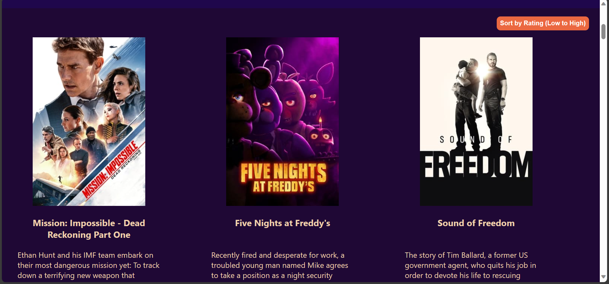

# Cinema+

Welcome to Cinema+, your ultimate movie companion! Explore a vast collection of movies with powerful features designed to enhance your movie-watching experience.

<h2 align="center"></h2>  
<h2 align="center"></h2>

## Features:

### 1. Infinite Scrolling
Enjoy an endless scroll of movie posters, ensuring you never run out of options. Seamlessly explore a vast collection of movies without interruption.

### 2. Sorting Options
Tailor your movie list based on your preferences. Toggle between sorting options to organize movies by rating, from high to low or low to high.

### 3. Genre Filters
Explore movies by genre to discover hidden gems within your favorite categories. Choose from a variety of genres to suit your mood and preferences.

### 4. Search Bar
Looking for something specific? Utilize our powerful search bar to find movies by title or keywords. Effortlessly navigate through our extensive database.

### 5. Watch Later List
Create your personalized watch later list. Click on the image to add movies to your watch later collection, ensuring you never miss a must-watch film.

### 6. Back-to-the-Top Button
Easily navigate back to the top of the page with a single click. Effortlessly switch between sections without endless scrolling.

### 7. Sleek and Intuitive UI
Our user interface is designed for simplicity and elegance. Enjoy a clean and intuitive layout that makes exploring movies a breeze.

## Why Cinema+?

- **Stay Updated:** Discover the latest releases and stay informed about the hottest movies in the industry.

- **Personalized Experience:** Tailor your movie exploration based on your preferences with sorting, genre filters, and a watch later list.

- **Effortless Navigation:** The app's intuitive design ensures a seamless and enjoyable browsing experience, whether you're a movie buff or a casual viewer.

- **Responsive and Accessible:** Access Movie Explorer Pro from any device, and enjoy a responsive design that adapts to your screen size.

## Get Started:

1. Clone this repository: `git clone https://github.com/your-username/movie-explorer-pro.git`
2. Install dependencies: `npm install`
3. Run the app: `npm start`

Ready to embark on a cinematic journey? Dive into the world of movies with Movie Explorer Pro – where every movie is a click away!

---
